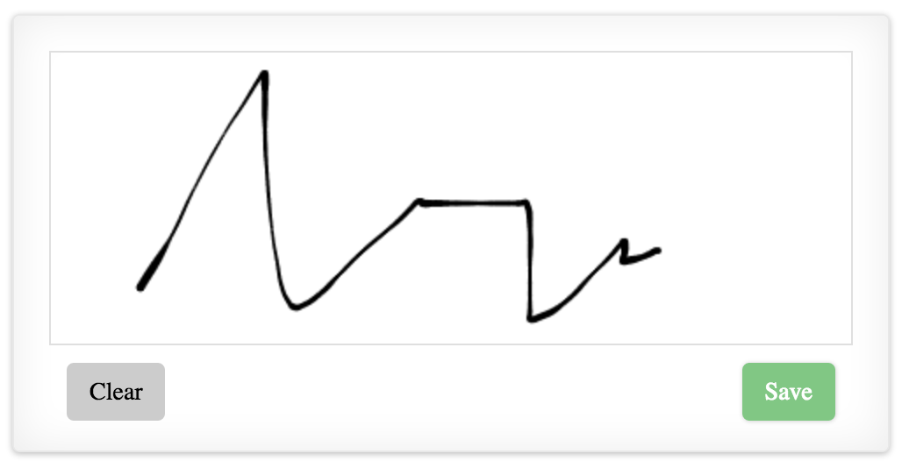

# React Signature

A signature board component for react. Implemented by referring to https://github.com/szimek/signature_pad. Compatible with all modern browsers. In order to make the component work for IE8, import excanvas at the top of your html file.


## Demo & Examples

	


Demo Repository: https://github.com/StrollHealth/react-signature

To build the examples locally, first clone the repository, then run:

```
npm install
npm start
```

Then open [`localhost:8000`](http://localhost:8000) in a browser.


## Installation

The easiest way to use react-signature is to install it from NPM and include it in your own React build process (using [Browserify](http://browserify.org), [Webpack](http://webpack.github.io/), etc).

You can also use the standalone build by including `dist/react-signature.js` in your page. If you use this, make sure you have already included React, and it is available as a global variable.

```
npm install react-signature --save
```


## Usage
To initialize:

```jsx
var ReactSignature = require('react-signature');

<ReactSignature ref="signatureboard"/>

...

var signatureboard = this.refs.signatureboard;

/* 
 * Method that converts the signature image to URL.
 * Returns the URL.
*/

signatureboard.toDataURL();


/* 
 * Method that takes a base 64 string (URL) and shows it as an image on the canvas.
*/

signatureboard.fromDataURL(base64String);


/* 
 * Method to clear the signature board.
*/

signatureboard.handleClear();
```
## Properties

React class properties:

width - width of the signature canvas. Default is 450.

height - height of the signature canvas. Default is 300.


## Development (`src`, `lib` and the build process)

**NOTE:** The source code for the component is in `src`. A transpiled CommonJS version (generated with Babel) is available in `lib` for use with node.js, browserify and webpack. A UMD bundle is also built to `dist`, which can be included without the need for any build system.

To build, watch and serve the examples (which will also watch the component source), run `npm start`. If you just want to watch changes to `src` and rebuild `lib`, run `npm run watch` (this is useful if you are working with `npm link`).

## License

The MIT License

Copyright (c) 2016 Quang Tran 

Permission is hereby granted, free of charge, to any person obtaining a copy
of this software and associated documentation files (the "Software"), to deal
in the Software without restriction, including without limitation the rights
to use, copy, modify, merge, publish, distribute, sublicense, and/or sell
copies of the Software, and to permit persons to whom the Software is
furnished to do so, subject to the following conditions:

The above copyright notice and this permission notice shall be included in
all copies or substantial portions of the Software.

THE SOFTWARE IS PROVIDED "AS IS", WITHOUT WARRANTY OF ANY KIND, EXPRESS OR
IMPLIED, INCLUDING BUT NOT LIMITED TO THE WARRANTIES OF MERCHANTABILITY,
FITNESS FOR A PARTICULAR PURPOSE AND NONINFRINGEMENT. IN NO EVENT SHALL THE
AUTHORS OR COPYRIGHT HOLDERS BE LIABLE FOR ANY CLAIM, DAMAGES OR OTHER
LIABILITY, WHETHER IN AN ACTION OF CONTRACT, TORT OR OTHERWISE, ARISING FROM,
OUT OF OR IN CONNECTION WITH THE SOFTWARE OR THE USE OR OTHER DEALINGS IN
THE SOFTWARE.


